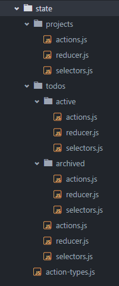

# Folder & File Structure

For all of these examples lets assume this is the current state tree:

```javascript
{
  projects: [],
  todos: [],
}
```

TL;DR

```
state
-- index.js
-- action-types.js
-- projects
---- actions.js
---- reducer.js
---- selectors.js
-- todos
---- actions.js
---- reducer.js
---- selectors.js
```
---

In many boilerplates and examples you will see the following folder layout:


This is reasonable when first starting out with Redux but quickly fails as your project scales. Instead of wasting time scrolling through your directories trying to find the correct file you need to modify when adding or updating a feature, it is much easier to have your directories organized and grouped by feature.

You should structure your folders in a 1-1 representation of your current state tree. This makes it incredibly easy to reason about and visualize your state since the folder structure should match your state exactly. It also keeps a nice clean separation of concerns (more about this later).


### Nested State Tree

For nested state trees you should still follow the rule of matching your folders to your state in a 1-1 fashion. For example if our state changed to something like this:

```
{
  projects: [],
  todos: {
    active: [],
    archived: [],
  },
}
```

Your folder structure would look like the following:



### Action Type Definitions

All action type definitions should live inside a `action-types.js` file in the root of your state folder. This keeps all of our actions contained and allows us to add and update new ones with relative ease.

### Store Composer

The main store composer should live inside a `index.js` file in the root of your state folder. The store composer should _only_ do the following things:

- Combine all of our reducers
- Setup middleware
- Create store
