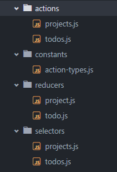

# Folder & File Structure

For all of these examples let's assume this is the current state tree:

```javascript
{
  projects: [],
  todos: [],
}
```
---

In most boilerplates and examples, authors lump together reducers, selectors, actions, and container components:



This is reasonable when first starting out with Redux but quickly fails as your project scales. After a while, maintaining your state to props functions inside container components can be cumbersome due to state structure changes or property renames. Also, it can be hard for a new developer coming to a project to get a feel for how components are composed or where / how their data is being created.

The structure of your folders should be an exact one-to-one representation of your current state tree. This makes it incredibly easy to reason about and visualize your state. It also keeps a nice clean separation of concerns between data sources (more about this later).


With this pattern you can infinitely nest your state tree while maintaining a clear idea as to where the appropriate files you need to work on are located. It also makes sense to colocate your reducer, actions, and selectors near each other to advocate the use of isolated state sections and decoupled data.

If there are any utility methods that need to be added to selectors, reducers, or actions, you now have the flexibility to put them in a features folder (if it's an isolated method) or in a `utils.js` file in the root of your state folder, if the method is used in various places.

## Nested State Tree

For nested state trees, still follow the rule of matching your folders to your state. For example, if our state changed to this:

```javascript
{
  projects: [],
  todos: {
    active: [],
    archived: [],
  },
}
```

Your folder structure would look like this:


In your parent reducers, you can utilize Redux's `combineReducers` method to group your child reducers together.

## Action Type Definitions

All action type definitions should live inside a `action-types.js` file in the root of your `state` folder. This keeps all of our actions contained and allows us to add and update new ones with relative ease.

```javascript
export const PROJECT_ADD = 'PROJECT_ADD';
export const PROJECT_REMOVE = 'PROJECT_REMOVE';

// block sections together via a new line

export const TODO_ADD = 'TODO_ADD';
export const TODO_REMOVE = 'TODO_REMOVE';
```

You can read about conventions for actions in the [Actions & Action Creators](actions-action-creators.md) chapter.

## Store Composer

The main store composer should live inside a `index.js` file in the root of your `state` folder. The store composer should _only_ do the following things:

- Combine all reducers
- Setup middleware
- Create store instance
- Export store instance

```javascript
import { createStore, applyMiddleware } from 'redux';
import thunk from 'redux-thunk';

// reducer import removed for brevity
const reducers = combineReducers(...);
const store = createStore(reducers, applyMiddleware(thunk));

export default store;
```
